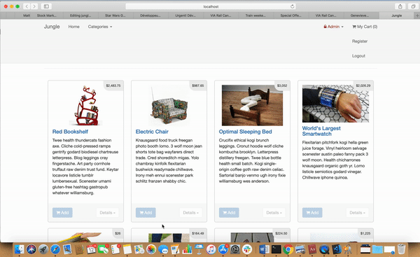

# Jungle

A mini e-commerce application built with Rails 4.2. The application was existing and features were added and bugs fixed.

## Video



## Getting Started
- clone repository to your local machine
- in terminal, navigate to project directory and run ```bundle install```
- create a ```.env``` file as per ```.env.example```
- create a ```database.yml``` file as per ```database.example.yml```
- create a  ```secrets.example.yml``` file as per ```secrets.example.yml```
- Sign up for a [Stripe](https://stripe.com/) account
- copy Stripe keys into .env file
- type ```rails db:reset``` in terminal to re-seed the database and create the tables
- type ```bin/rails s -b 0.0.0.0``` in terminal to start the server
- navigate to ```localhost:3000``` in your browser
- use credit card number ```4111 1111 1111 1111``` and any date in the future for the credentials
